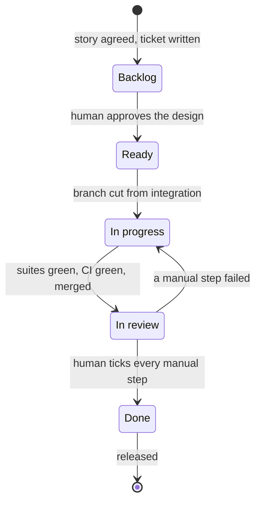

# kanban-tdd

Ticket-driven development on a GitHub project board, for Claude Code.

Work moves Backlog → Ready → In progress → In review → Done, and **each
transition has to prove itself**: a ticket before code, the user story agreed
before the technical design, a failing test committed before the code that
passes it, and a written manual step for anything only a human can confirm.

It does not tell you how to think, how to test, or how to review. Those are
delegated to whichever skills you already use.

## Install

```
/plugin marketplace add amlwwalker/kanban-tdd
/plugin install kanban-tdd
```

Then, once per repository:

```
/board-setup
```

That finds or creates the board, maps its columns, works out your test
commands, and writes `.claude/workflow.config.json`. After that, start
everything — a feature, a bug, a loose idea — with `feature-workflow`.

Needs [`gh`](https://cli.github.com) with the `project` scope
(`gh auth refresh -s project`) and `jq`.

## The state machine



Two transitions a machine never performs: **Backlog → Ready** and
**In review → Done**. Both are human judgement, and they are the only gates in
the process that cannot be self-certified.

## The skills

| Skill | Does |
|---|---|
| `feature-workflow` | The router. Works out which phase you are in and hands off. Start here. |
| `board-setup` | One-time per-repo configuration. `/board-setup` |
| `ticket-authoring` | Story first, agreed, **then** design, criteria and test plan. |
| `ticket-refinement` | Is this ticket startable? Verdict, then promote on your say-so. |
| `red-green` | The implementation loop. Owns the red→green commit evidence. |
| `design-sketching` | When a Mermaid diagram earns its place in a ticket, and how to draw it. |
| `manual-test-design` | What genuinely needs a human, and steps they can follow. |
| `review-handoff` | Green, evidence checked, PR merged, checklist on the ticket. |
| `verification-failed` | A manual step failed: record it, label it, send the card back. |
| `release-to-production` | Integration → production, only for cards a human moved to Done. |

## What makes it different

**The red commit is the evidence.** Two commits minimum per behaviour —
`test(red):` alone, then `feat(green):`. Never squashed locally. A reviewer can
check out the red commit and watch the test fail, and `review-handoff` refuses
to claim TDD happened without checking the log.

**The user story is a gate, not a section.** `ticket-authoring` stops after the
story and asks. No endpoints, no criteria, no test plan until you agree it. A
story that is wrong costs a paragraph to fix there and three sections to fix
afterwards.

**Every acceptance criterion has a test.** The test plan names the criterion
each test proves, and refinement rejects a ticket with an orphaned criterion —
because that is the one that gets ticked at review for sounding true.

**Failure has a path.** A failed manual check comments what was seen, labels
the ticket, and sends the card back to In progress. The fix starts with a red
test reproducing the failure: a bug a human found is still a bug.

**Comments are part of the ticket.** Every skill reads body *and* comments
before acting, and `ghboard comments <n> --after-commit` shows what landed since
your last commit — which is exactly when scope changes arrive.

## Capabilities: bring your own thinking

These skills own the board. The thinking is delegated, so you can use what you
already have:

| Capability | Preferred | Fallback | Built-in |
|---|---|---|---|
| `design-interview` | `grilling` | `superpowers:brainstorming` | yes, thinner |
| `tdd-discipline` | `tdd` | `superpowers:test-driven-development` | yes, thinner |
| `ticket-slicing` | `to-tickets` | — | yes, thinner |
| `code-review` | `code-review` | `/code-review` | yes, a checklist |
| `ui-style` | yours, named in config | — | skipped |

Resolution is config → detect → ask once → record the answer, so it never nags.
Nothing is required: with none of it installed you still get a working workflow,
just a thinner interview.

The preferred providers come from **[Matt Pocock's
skills](https://github.com/mattpocock/skills)**, which this was built against
and which I recommend:

```
claude plugins install mattpocock-skills
```

His `tdd` covers what a good test is — seams, anti-patterns, vertical slices.
This plugin covers whether the test was ever red. They compose; that is why
there is no competing `tdd` here.

## Configuration

`.claude/workflow.config.json`, written by `/board-setup`. Everything
repo-specific lives there — board, columns, branches, test commands,
capabilities, environments. The skills never change.

Point your editor at the schema for autocomplete:

```json
{
  "$schema": "https://raw.githubusercontent.com/amlwwalker/kanban-tdd/main/skills/board-setup/references/workflow.config.schema.json"
}
```

Column *names* are yours. "Icebox / Up next / Building / Testing / Shipped" maps
onto the five phases fine — `ghboard validate` checks the mapping against the
live board and refuses to guess when it disagrees.

## ghboard

The only thing that talks to the board:

```
ghboard validate              config vs the live board
ghboard list [phase]          every card, or one column
ghboard find <text>           search titles and bodies
ghboard next                  what to pick up
ghboard stale [days]          backlog cards that are old or incomplete
ghboard read <issue>          body AND comments
ghboard comments <issue> --after-commit    what landed since your last commit
ghboard status <issue>        which column
ghboard add|move <issue> [phase]
```

`phase` is always a key — `backlog`, `ready`, `inProgress`, `inReview`, `done` —
never a display name. Rename a column on the board, change one line of config,
everything keeps working.

## What it will not do

- Move a card to Ready or to Done.
- Write code before a ticket exists.
- Commit a test it has not watched fail.
- Open a PR on a red branch, or merge with CI failing.
- Release anything whose card is not in Done without telling you what is
  unverified.
- Invent board columns, issue numbers, or test results.

## Working offline

Board and PR steps need `gh` and network. Branches, TDD and commits do not.
Without `gh` the workflow runs in local mode and says which steps are
outstanding — deferred, not skipped.

## Credits

The seam vocabulary, vertical-slice and tracer-bullet rules are adapted from
[Matt Pocock's skills](https://github.com/mattpocock/skills) (MIT).

## License

MIT
