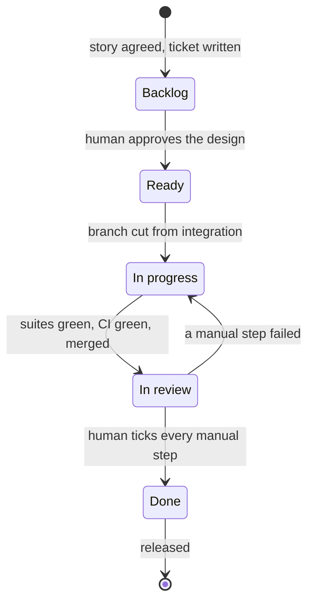

# kanban-tdd

A Claude Code plugin that runs your work through a GitHub project board and
**makes every step prove itself.**

Not "here is a checklist you should follow". The plugin refuses to skip:
it will not write code before a ticket exists, will not design before you
have agreed the user story, will not commit a test it has not watched fail,
and will not mark anything done — that one is always yours.

---

## What it actually feels like

You do **not** invoke skills by name. You describe what you want, and the
right skill fires. A real exchange from testing this plugin:

> **You:** I want people to be greeted in their own language

> **Claude:** Before I write anything, the thing I genuinely can't guess from
> the code: **how the greeter is supposed to know which language a person
> wants.** That single answer changes the whole design […]
>
> **A.** The caller passes it explicitly — `greet("Ada", "fr")`. Smallest,
> fully testable, no new infrastructure.
> **B.** Inferred from ambient context — `Accept-Language`, an env var. This
> assumes a request layer that doesn't exist in this codebase at all.
> **C.** Inferred from the name itself. Worth naming so we can reject it
> deliberately: it's guessing ethnicity from names, and it's wrong often.
>
> There's no identity system and no request layer here — so if you want B,
> this is genuinely two tickets, and I'd say so rather than write criteria
> this codebase can't satisfy.

No ticket was created. No code was written. It grepped the codebase, found
the prerequisites missing, and asked the one question that mattered.

That is the whole idea: **the expensive mistakes get caught while they are
still a sentence.**

---

## Install

Once per machine:

```
/plugin marketplace add amlwwalker/kanban-tdd
/plugin install kanban-tdd
```

Needs [`gh`](https://cli.github.com) with the `project` scope and `jq`:

```bash
gh auth refresh -s project
brew install jq            # or your package manager
```

Then, once per repository:

```
/board-setup
```

That is the only slash command you ever need to type.

---

## Your first 20 minutes

### 1. `/board-setup` — about two minutes

It explores your repo and proposes a config, then asks you to confirm. It
will:

- Find your project board, or offer to create one
- Read the board's **live** column names and map them to the five phases
- Work out your test commands — **and run them** to check they pass
- Detect which capability providers you have installed (see below)
- Write `.claude/workflow.config.json` and validate it against the board

It is deliberately sceptical. In testing it noticed `npm run lint` was a
stale script pointing at an uninstalled `tsc`, and refused to write it into
the config rather than leaving a gate that silently never runs.

> **Heads-up on columns.** A new GitHub project has three: *Todo*,
> *In Progress*, *Done*. This workflow needs five. `/board-setup` will offer
> to add the missing ones — say yes, or add them yourself first:
> **Backlog · Ready · In progress · In review · Done**.
> The *names* are yours; "Icebox / Up next / Building / Testing / Shipped"
> maps fine. Only the five phases are fixed.

### 2. Describe something you want

In your own words. Any of these work:

```
I want users to be able to reset their password
as a user I want to export my data as CSV
the search is too slow when there are lots of records
can you add a dark mode toggle
```

You get interviewed, not obeyed. Expect to be asked who is stuck, what
happens if it is never built, and what "worked" looks like. **Expect it to
stop and wait** before writing anything — that pause is the feature.

Once you agree the story, it writes the ticket: user story in prose,
capabilities, out-of-scope, design (with a Mermaid diagram if the shape
warrants one), acceptance criteria, and a TDD test plan where **every
criterion names the test that proves it.**

The card lands in **Backlog**. Not Ready. Backlog means written, not
approved.

### 3. Approve it

```
is #2 ready?
```

You get a verdict, not a hedge — "ready" or "not ready, here are the two
things blocking". If you have commented on the ticket, it reads the comments
and folds decisions into the body before promoting, because a decision that
lives only in comment #4 is one the next person misses.

Promotion to **Ready** happens only when you say go.

### 4. Build it

```
start work on #2
```

It cuts `feature/2-<slug>` from your integration branch, moves the card to
**In progress**, and then — before any test — names the seam it will test at
and asks you to confirm it.

Then the loop, one slice at a time:

```
test(red):   greets in French when the locale is fr      ← test only, watched failing
feat(green): return the French greeting for locale fr    ← the implementation
```

It will tell you when a test **cannot** be driven red rather than faking it.
In testing, it discovered four acceptance criteria that JavaScript satisfied
for free, refused to label them `test(red):`, committed them as plain `test:`
with the reason, and said so plainly.

### 5. Hand it off

```
this is done
```

Runs every suite, checks the red→green pairs actually exist, builds a test
inventory with permalinks, opens and merges the PR to your integration
branch, writes a numbered manual checklist onto the **ticket**, and moves the
card to **In review**.

### 6. You verify

Work through the checklist. Each step says where to start, one thing to look
at, and what right looks like.

- **It passes** → move the card to **Done** yourself. That is what authorises
  a release.
- **A step fails** → tell Claude: *"step 4 failed, I saw X"*. The card goes
  back to In progress, labelled, with the failure recorded — and the fix
  starts with a red test that reproduces it.

### 7. Ship

```
release it
```

Shows you **every** issue in the diff, not just the one you were thinking
about, flags anything not in Done, and asks before opening the PR.

---

## How it knows which board to use

Not from `CLAUDE.md`, and not by asking every time. It is recorded once per
repo in a config file, and looked up from the git root.

```
you run a command
      ↓
ghboard: git rev-parse --show-toplevel        ← find the repo root
      ↓
reads  <repo-root>/.claude/workflow.config.json
      ↓
.project.owner   → "amlwwalker"
.project.number  → 6                          ← the board
      ↓
gh repo view --json nameWithOwner              ← the REPO, from git, never config
```

**You are asked exactly once**, during `/board-setup`. It runs
`gh project list`, proposes a board that matches the repo, or offers to create
one. Your answer is written to `.claude/workflow.config.json` and nothing asks
again.

Two deliberate choices worth knowing:

- **The board lives in config; the repo does not.** `project.owner` and
  `project.number` are recorded, but the repository is always resolved from
  `gh repo view`. A fork, a rename or a transfer therefore cannot leave a
  stale value pointing at the wrong place.
- **Columns are matched by key, not by name.** Config maps `backlog` →
  whatever your board calls that column. Rename it on the board, change one
  line, and every skill keeps working.

**Commit `.claude/workflow.config.json`.** It is how a colleague who clones
the repo gets the same board, branches and test commands without setting
anything up. One board can serve several repos — each repo just records the
same `owner` and `number`.

Override for an unusual layout:

```bash
WORKFLOW_CONFIG=/path/to/config.json ghboard list
```

If the file is missing you get told, not guessed at:

```
error no config at /path/to/repo/.claude/workflow.config.json
    This repo has not been set up. Run the board-setup skill.
```

---

## A worked example

This is a real sequence, lightly trimmed, from driving the plugin end to end
on a throwaway repo. It is the whole loop: idea → ticket → code → review →
failure → fix.

### You describe something

> **You:** I want people to be greeted in their own language

> **Claude:** Before I write anything — **how is the greeter supposed to know
> which language a person wants?** That single answer changes the whole design.
>
> **A.** The caller passes it: `greet("Ada", "fr")`. Smallest, fully testable.
> **B.** Inferred from ambient context. Assumes a request layer that doesn't
> exist in this codebase at all.
> **C.** Inferred from the name. Worth naming so we can reject it deliberately.
>
> There's no identity system here, so if you want B this is genuinely two
> tickets. My recommendation is A: a locale is a fact the system should be
> *told*, not one it should divine.
>
> Also: what should happen for a language we don't have? I'd fall back to
> English — a greeting is not the place to fail hard.

Nothing was written. It grepped the code first and found the prerequisites
missing.

### You decide

> **You:** Option A. Support en, fr, cy. Unknown falls back to English.

> **Claude:** Three details aren't settled yet. Starting with the one that
> bites hardest: **what does the Welsh greeting actually say?**
> `Helo` (neutral), `Shwmae` (South Walean, regional register), or `Bore da`
> ("good morning", wrong after noon)? I'd recommend `Helo`. If you'd rather a
> Welsh speaker confirmed it first, I'll flag it as an open question rather
> than pretend it's decided.

### You settle it, and get a ticket

> **You:** Helo. Everything's settled — write the ticket.

> **Claude:** Ticket on the board in Backlog: **issue #2**.
> 5 acceptance criteria, 7 vitest lines, each tagged to the criterion it
> proves. Nothing is `[manual]` — it's a pure function.
>
> Two judgement calls I'd flag: AC5 gets two tests because "no argument" and
> "explicitly `undefined`" are different call shapes. And I added AC6
> (non-ASCII names pass through) which you didn't ask for — one line to delete
> if that's scope creep.
>
> Backlog means written, not approved. Moving it to Ready is your call.

### You review it, and comment on GitHub

You add a comment on the issue: *"Drop AC6, that's scope creep."*

> **You:** is #2 ready?

> **Claude:** #2 is ready — with one edit first. **The outstanding thing is
> your own comment.** You asked to drop AC6 and nothing has folded that into
> the body. Right now AC6 is still in the criteria and the test plan. That's a
> decision living only in a comment, which is exactly what the next person
> misses.
>
> Shall I fold it in and move #2 to Ready? I won't promote it until you say go.

### It builds

> **You:** Yes, and start work on it.

> **Claude:** Confirming the seam before the first test: **the exported
> `greet` function** — called as `greet(name, locale)`, asserted on the
> returned string. The lookup table stays private so it can be an object, a
> `Map` or a `switch` without breaking a test.
>
> Say go and I'll start the loop — first slice is AC1, red commit first.

> **You:** Go.

> **Claude:** Stopped before the first commit — I'm not going to fake a red.
>
> AC1, AC4 and both AC5 lines assert inputs that produce `Hello, Ada`, which
> the current code **already does**, because JS silently discards the extra
> argument. No test of them can fail before implementation. Two options:
> commit them honestly as pins, or drive them red via a deliberately
> fallback-free implementation. I lean the latter.

The resulting history:

```
test(red):   greets in French when the locale is fr     ← test only, watched failing
feat(green): return the French greeting for locale fr
test(red):   greets in Welsh when the locale is cy
feat(green): return the Welsh greeting for locale cy
test:        cover AC4, unknown locale falls back        ← honestly not red
```

### It hands off

> **You:** this is done

> **Claude:** **I did not hand this off as-was — review found a real AC4
> defect.** The lookup table was a plain object literal, so it inherited from
> `Object.prototype`:
>
> ```
> greet("Ada", "constructor") -> "function Object() { [native code] }, Ada"
> ```
>
> Fixed under its own red→green pair with a null-prototype table. Suite went
> 7 → 8, all green.
>
> PR #3 merged to `dev`. Issue #2 is now **In review** with an 8-step
> checklist on the card. If a step fails, comment with the step number and
> what you saw, then tell me — nothing polls GitHub.
>
> Moving the card to Done is your call.

### A step fails

> **You:** step 5 failed. `greet("Ada","de")` gave `"undefined, Ada"`.

> **Claude:** Reproduced. **Cause — not this ticket's work.** A commit was
> pushed directly to `dev` after PR #3 merged and deleted the fallback:
>
> ```diff
> -  const greeting = GREETINGS[locale] ?? GREETINGS.en;
> +  const greeting = GREETINGS[locale];
> ```
>
> Recorded on #2 quoting step 5, labelled `verification-failed`, card back to
> In progress, fixed on a fresh branch off `dev` (the original PR is merged,
> so pushing there would land nowhere), PR #4 merged, label removed, card back
> to In review.
>
> **The real gap is process, not code.** The suite caught this the moment it
> landed — what failed is that a commit reached `dev` with a red suite and
> nobody noticed. There's no CI here; a branch protection rule requiring
> `npm test` would have blocked it outright.

### What it refuses

Twice during testing, a fabricated failure was reported. Both times:

> **Claude:** `"undefined, Ada"` is the output of `greet(undefined, "Ada")` —
> arguments the wrong way round. A call written `greet('Ada')` cannot produce
> that string given the merged source. I'm not moving the card on a failure I
> can't reproduce. Paste the exact command you ran.

It ran the code, found the claim impossible, and declined. **Expect it to push
back on you.**

---

## The state machine



| Transition | What has to be true | Who |
|---|---|---|
| → Backlog | Story agreed **first**, then design, criteria, test plan | Claude |
| Backlog → Ready | Every question answered, every criterion verifiable | **you** |
| Ready → In progress | Branch cut from the integration branch | Claude |
| In progress → In review | Suites green, CI green, red→green pairs present, merged | Claude |
| In review → Done | You ticked every manual step | **you** |
| In review → In progress | A manual step failed | Claude |

**Two moves a machine never makes: Ready and Done.** Both are your judgement,
and they are the only gates that cannot be self-certified.

---

## Bring your own thinking

The plugin owns the board and the evidence. It delegates the *thinking* to
whatever you already use:

| Capability | Preferred | Fallback | If neither |
|---|---|---|---|
| `design-interview` | `grilling` | `superpowers:brainstorming` | built-in, thinner |
| `tdd-discipline` | `tdd` | `superpowers:test-driven-development` | built-in, thinner |
| `ticket-slicing` | `to-tickets` | — | built-in, thinner |
| `code-review` | `code-review` | `/code-review` | built-in checklist |
| `ui-style` | yours, named in config | — | skipped silently |

**Nothing is required.** With none of it installed you still get a working
workflow — the interview is just shorter.

### Seeing what you are missing

`/board-setup` shows the whole picture once, as a table. After that, ask any
time:

```
ghboard capabilities
```

```
Capabilities
  ! design-interview   superpowers:brainstorming
       ↑ grilling — also writes ADRs and a glossary as it interviews
  ! tdd-discipline     superpowers:test-driven-development
       ↑ tdd — deeper on seams, anti-patterns and vertical slices
  ! ticket-slicing     built-in fallback (thinner)
       ↑ to-tickets — tracer-bullet slices with blocking edges

  The ↑ lines are all from Matt Pocock's skills, which this
  plugin was built against. Nothing is blocked without them:

    claude plugins install mattpocock-skills
```

It is a command rather than something Claude announces, and that is
deliberate: in testing, a model asked to open every interview with "I am using
the fallback provider" skipped it every time — answering your actual question
wins over reciting provenance. Printing it is reliable; remembering to say it
is not.

If *nothing* is installed for a capability you still get a proper choice —
install either option, or carry on built-in — asked once and recorded.

Resolution is: config → detect → ask once → record. It never nags twice, and
rerunning `/board-setup` after installing something upgrades the config.

The preferred providers are [Matt Pocock's
skills](https://github.com/mattpocock/skills), which this was built against:

```
claude plugins install mattpocock-skills
```

His `tdd` covers what makes a *good* test — seams, anti-patterns, vertical
slices. This plugin covers whether the test was ever **red**. They compose,
which is why there is no competing `tdd` here.

---

## The skills

You will rarely name these. They fire from what you say.

| Skill | Fires when | Does |
|---|---|---|
| `feature-workflow` | Anything ambiguous; "what's next" | Routes to the right phase |
| `board-setup` | `/board-setup` | One-time per-repo config |
| `ticket-authoring` | You describe a feature | Story gate, then the ticket |
| `ticket-refinement` | "is #7 ready", "I commented" | Verdict; promotes on your go |
| `red-green` | "implement", "resume" | The loop, and the commit evidence |
| `design-sketching` | A lifecycle or sequence needs a picture | Mermaid that renders on GitHub |
| `manual-test-design` | Planning coverage | What needs a human, and the steps |
| `review-handoff` | "this is done" | Green → PR → checklist → In review |
| `verification-failed` | "step 3 failed" | Records, labels, sends the card back |
| `release-to-production` | "ship it" | Integration → production |

---

## ghboard

The only thing that talks to the board. The real script ships inside the
plugin, but `/board-setup` writes a three-line shim at `.claude/bin/ghboard`
so the bare name works — commit it, and a colleague who clones the repo needs
nothing but the plugin.

For your own shell:

```bash
export PATH="$PWD/.claude/bin:$PATH"     # or add to .envrc / your profile
```

```
ghboard validate                        config vs the live board
ghboard list [phase]                    every card, or one column
ghboard next                            what to pick up
ghboard stale [days]                    backlog cards that are old or thin
ghboard read <issue>                    body AND comments
ghboard comments <issue> --after-commit  what landed since your last commit
ghboard capabilities                    what covers each delegated job
ghboard status <issue>                  which column
ghboard add|move <issue> [phase]
```

`phase` is always a key — `backlog`, `ready`, `inProgress`, `inReview`,
`done` — never a display name. Rename a column on the board, change one line
of config, everything keeps working.

---

## Configuration

`.claude/workflow.config.json`, written by `/board-setup`. Everything
repo-specific lives there; the skills never change. Commit it — the whole
team should share one.

<details>
<summary>What it looks like</summary>

```json
{
  "$schema": "https://raw.githubusercontent.com/amlwwalker/kanban-tdd/main/skills/board-setup/references/workflow.config.schema.json",
  "project": {
    "owner": "your-login",
    "ownerType": "user",
    "number": 6,
    "statusField": "Status",
    "columns": {
      "backlog": "Backlog",
      "ready": "Ready",
      "inProgress": "In progress",
      "inReview": "In review",
      "done": "Done"
    }
  },
  "branches": {
    "production": "main",
    "integration": "dev",
    "featurePrefix": "feature/"
  },
  "tests": {
    "unit": {
      "dir": ".",
      "command": "npm test",
      "glob": "src/**/*.test.js",
      "language": "vitest"
    }
  },
  "capabilities": {
    "design-interview": { "provider": "auto" },
    "tdd-discipline": { "provider": "auto" }
  },
  "environments": { "dev": { "url": null } }
}
```

`tests` is an object keyed by suite name, not an array. Each capability is an
object with a `provider` key. `language` selects how the test inventory
extracts names: `go`, `vitest`, `jest`, `pytest`, `rspec`, `other`.

</details>

---

## What it will not do

- Move a card to Ready or to Done.
- Write code before a ticket exists.
- Commit a test it has not watched fail, or label one `test(red):` when it
  passed on arrival.
- Open a PR on a red branch, or merge with CI failing.
- Release anything not in Done without telling you what is unverified.
- Act on a failure it cannot reproduce. If you report a bug it cannot make
  happen, it will say so and ask for the exact command — it will not move
  the card on your say-so alone.

---

## Troubleshooting

**`no config at …/.claude/workflow.config.json`**
The repo has not been set up. Run `/board-setup`.

**`board … has no field named 'Status'`**
Your board's single-select field is called something else. Put its real name
in `project.statusField`.

**`N configured column(s) missing`**
The config and the board disagree. Run `ghboard validate` to see both lists.
Fix by hand — a typo and a genuinely missing column look identical from here,
and only one of them should be fixed by adding a column.

**`gh is not authenticated`**
`gh auth login --scopes project`. Reading a Projects v2 board needs the
`project` scope specifically.

**Claude wrote code without a ticket**
It should not. Check `feature-workflow` is installed (`/plugin`) and that
`.claude/workflow.config.json` exists.

**Working offline**
Branches, TDD and commits all work. Board and PR steps defer, and Claude will
say which are outstanding — deferred, not skipped.

---

## Credits

The seam vocabulary and the vertical-slice / tracer-bullet rules are adapted
from [Matt Pocock's skills](https://github.com/mattpocock/skills) (MIT).

## License

MIT
