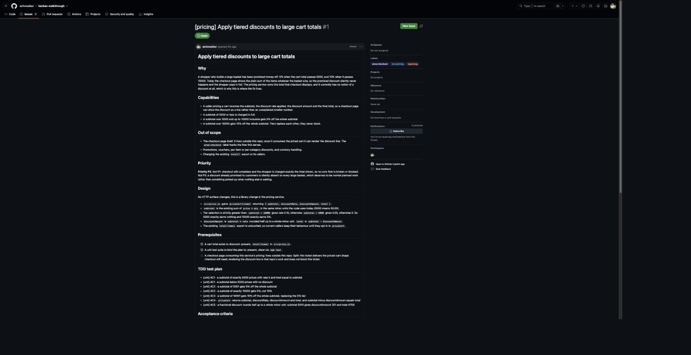
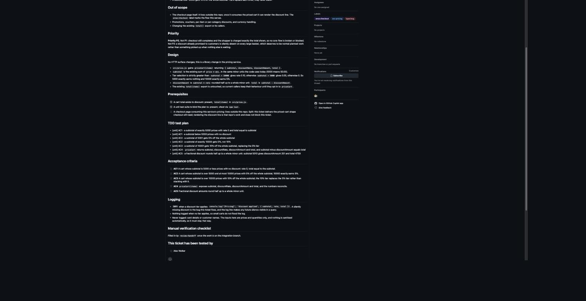
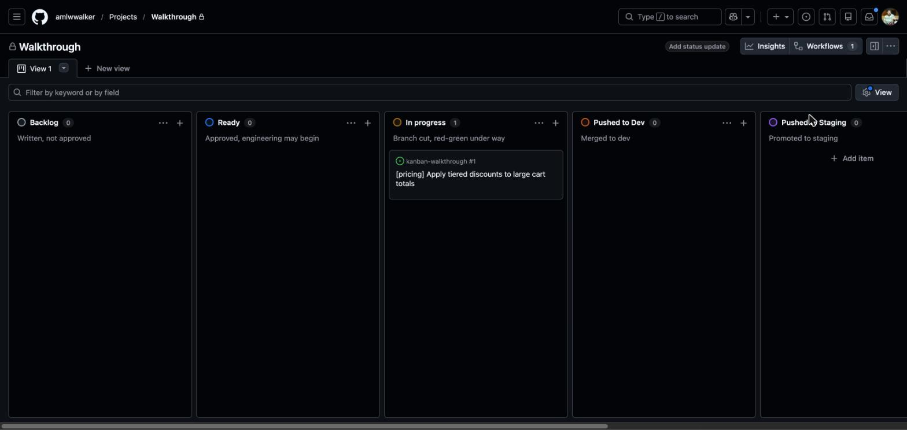
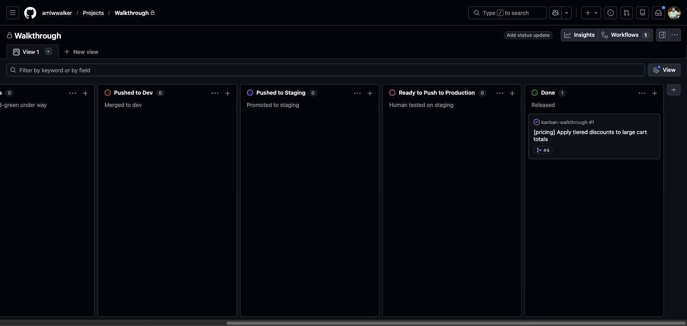

# A walkthrough

One ticket, start to finish, on a real board. Nothing here is mocked up: every
screenshot, commit message and comment below is from a single recorded run
against [`amlwwalker/kanban-walkthrough`](https://github.com/amlwwalker/kanban-walkthrough)
and a seven-column GitHub project.

The repo is a deliberately tiny cart-total library, so the interesting part is
the *process* rather than the code.

> **This run predates three later additions**, and the screenshots below show
> the workflow without them. They are described in the README rather than
> re-staged here, because re-shooting them would mean a walkthrough that is no
> longer a single honest recording:
>
> - **The behavioural interview** — failure modes, input domains and parity
>   walked before the criteria are written, so the test plan covers more than
>   the happy path.
> - **Design docs and anchors** — the detail lives in `design-docs/` with the
>   ticket carrying a synopsis, and code links back by a verified ID.
> - **Browser evidence** — screenshots captured at each width and published to
>   the ticket.
>
> Everything shown below still happens, in the same order, at the same gates.

---

## Setup

The repo has three branches — `main`, `dev`, `staging` — and the board has
seven columns, because this project opens a PR per environment.

```
$ /board-setup
```

It reads the live board rather than assuming, runs the test command to check
it actually passes, and writes `.claude/workflow.config.json`. Then:

```
$ ghboard validate
  ✓ repo:  amlwwalker/kanban-walkthrough
  ✓ board: amlwwalker/8
  live Status options: Backlog, Ready, In progress, Pushed to Dev,
                       Pushed to Staging, Ready to Push to Production, Done
  ✓ backlog -> 'Backlog'
  ✓ ready -> 'Ready'
  ✓ inProgress -> 'In progress'
  ✓ pushedToDev -> 'Pushed to Dev'
  ✓ pushedToStaging -> 'Pushed to Staging'
  ✓ readyForProd -> 'Ready to Push to Production'
  ✓ done -> 'Done'
  review flow: pushedToDev pushedToStaging readyForProd
  ✓ config matches the board
```

Setup also recorded this project's **logging policy** (console only, house call
pattern `console.log('[Pricing]', message, meta)`, never log card details or
customer names, nothing sanitised automatically) and its **taxonomy**
(`type:`, `svc:`, `area:`). Both matter later.

---

## 1. Describe what you want

No skill is invoked by name. The whole interaction is:

> **I want tiered discounts on the cart: 5% off when the cart total is over
> 5000, 10% over 10000.**

What comes back is not code. It is a ticket in **Backlog**, classified,
prioritised, and with the design questions already answered.



Three things in that screenshot are worth pointing at.

**It decided this is a bug, not a feature.** The discount was promised to
shoppers and silently never happens, and the type decision tree says
promised-and-absent is a bug. Labels `type:bug`, `svc:pricing` and
`area:checkout` were applied automatically — the service inferred from the git
remote, not guessed.

**The priority argues both boundaries:**

> **Priority P2.** Not P1: checkout still completes and the shopper is charged
> exactly the total shown, so no core flow is broken or blocked. Not P3: a
> discount already promised to customers is silently absent on every large
> basket, which deserves to be normal planned work rather than something
> picked up when nothing else is waiting.

That sentence is the point of the priority field. It gives a human something
specific to disagree with, rather than a level to accept on faith.

**The prerequisites are checked against the code, not assumed.** The third one
is unticked on purpose: the checkout page lives outside this repo, so the
ticket records a split rather than pretending it is in scope.

---

## 2. The test plan and the logging



Every test line names the acceptance criterion it proves, and the tags are
`[unit]` — a key from this project's config, not a framework name.

Then the section that only exists because setup recorded a logging policy:

```markdown
## Logging

- INFO when a discount tier applies: console.log('[Pricing]', 'discount
  applied', { subtotal, rate, total }). A silently missing discount is the bug
  this ticket fixes, and the log line makes any future silence visible in a query.
- Nothing logged when no tier applies, so small carts do not flood the log.
- Never logged: card details or customer names. The inputs here are prices and
  quantities only, and nothing is sanitised automatically, so it must stay that way.
```

Logging designed at ticket time gets built. Logging remembered at review gets
bolted on by whoever notices. The last line came from the config's honest
admission that this project sanitises nothing.

At the bottom: a named tester checkbox, from config. Sign-off has an owner.

---

## 3. Review it, in GitHub

The card is in **Backlog** — written, not approved. Reviewing means commenting
on the issue like you would on anyone's work:

> Reviewed. Two things before this is Ready:
>
> 1. **AC3 says the 10% tier replaces the 5% tier.** Good, but the test plan
>    has no case proving they do not stack. Add one: a subtotal of 20000 should
>    be 18000, not 17100.
> 2. The design says rounding is half up. Confirm that is on the discount
>    amount rather than the final total, since rounding the total instead would
>    drift by a unit on some carts.

Then, back in the terminal:

> **I commented on #1. Read it, fold the answers into the body, and move it to
> Ready — rounding is on the discount amount, confirmed.**

Both points were folded into the **body**, not left in the thread, with a
refinement footer recording what changed and why. A decision that lives only in
comment #4 is one the next person misses.

The card moves to **Ready** — but only because a human said so. That gate is
never crossed automatically.

---

## 4. Build it

> **Start work on #1 and run the whole red-green loop through to green.**

It cuts `feature/1-tiered-cart-discounts` from `dev`, moves the card to
**In progress**, confirms the seam, and works down the test plan.



Six slices, each a genuine pair:

```
3825f94  test(red):   a cart at or below 5000 prices with no discount
8cf2f39  feat(green): priceCart returns the undiscounted subtotal
8465118  test(red):   a subtotal over 5000 and up to 10000 inclusive earns 5%
240568a  feat(green): apply the 5% tier to subtotals over 5000
61b83a3  test(red):   a subtotal over 10000 earns 10%, replacing the 5% tier
e9c8e78  feat(green): apply the 10% tier to subtotals over 10000
9f88224  test(red):   priceCart exposes discountAmount and the numbers reconcile
15ae224  feat(green): expose discountAmount on the priced cart
d7e8443  test(red):   fractional discounts round half up to a whole minor unit
22f97b4  feat(green): round the discount amount half up
bc26fd8  test(red):   the discount line is logged only when a tier applies
5289a5b  feat(green): log the discount line when a tier applies
```

The last pair is the logging line from the ticket, driven out like any other
behaviour rather than added as an afterthought.

The evidence is checkable, which is the whole point. Every `test(red):` commit
touches only the test file:

```
$ git show --stat 61b83a3
 src/price.test.js | 12 ++++++++++++
```

And checking one out proves it was genuinely red:

```
$ git checkout 61b83a3 && npm test
  ⎯⎯⎯ Failed Tests 2 ⎯⎯⎯
```

A test that has never been red proves nothing. Here you can prove it was.

---

## 5. Hand off to dev

> **#1 is done — hand it off for review.**

Ten of ten green, six red/green pairs verified, PR #2 opened and merged to
`dev`, a seven-step manual checklist written onto the ticket, card moved to
**Pushed to Dev**.

The PR says `Refs #1`, never `Closes`. `Closes` would close the issue the
moment the PR merged — before a human has tried it, and long before it reaches
production.

It also reported something it could have hidden:

> The configured `code-review` provider could not run — its review agents all
> died on an environment error. I reviewed the diff inline instead and found
> nothing.

---

## 6. Promote to staging

> **Promote dev to staging.**

PR #3, merged with a merge commit (not a squash — the branches must keep a
shared history or the next diff is meaningless). Card to **Pushed to Staging**,
and a comment on the ticket:

> Promoted to staging in PR #3. Waiting on a human to verify on staging: work
> through the manual checklist against the `staging` branch, then move this
> card to Ready to Push to Production. Nothing reaches `main` until that happens.

---

## 7. The gate that matters

> **Now promote staging to production.**

It refused:

> **Why I stopped:** this repo uses the PR-per-environment flow, and a
> staging → production PR may only carry tickets in "Ready to Push to
> Production" — the column a human moves a card to after testing it on staging.
> Ticket #1 is still in **"Pushed to Staging"**. Its manual checklist is
> unticked, the "tested by" box is unticked […]. I'm not allowed to move the
> card myself; that would fake the only gate a machine can't legitimately pass.
>
> If you want to knowingly ship it unverified, say so explicitly and I'll
> proceed on that instruction.

This is what the extra columns buy. On a single review column, that half-tested
ticket ships with the next release and nobody notices. Here it cannot.

The human then does the testing and moves the card:

> Verified on staging. Worked through all seven steps against a checkout of
> `staging`:
> - Steps 1-2: boundaries behave, 5000 exactly earns nothing and 5001 earns 5%.
> - Step 4: 20000 gives 18000, so the tiers replace rather than compound.
> - Steps 6-7: the log line appears only when a tier applies, and carries no
>   customer data.

---

## 8. Ship it

> **I have verified #1 on staging and moved it to Ready to Push to Production.
> Promote staging to production now.**

PR #4, `staging` → `main`, merged. This is the one place `Closes` is
legitimate, so issue #1 closes. The card lands in **Done**.



The PR body carries a rollback section, written before it is needed rather
than during an incident.

---

## The trail it leaves

| | |
|---|---|
| **Issue** | [#1](https://github.com/amlwwalker/kanban-walkthrough/issues/1) — closed, 3 labels, 5 comments |
| **PR #2** | `feature/1-tiered-cart-discounts` → `dev` |
| **PR #3** | `dev` → `staging` |
| **PR #4** | `staging` → `main` |
| **Commits** | 6 red/green pairs, none squashed |
| **Board** | Backlog → Ready → In progress → Pushed to Dev → Pushed to Staging → Ready to Push to Production → Done |

Every transition is on the card. Every decision is in the ticket body. Every
test was red before it was green, and you can check.

---

## Two gates a machine never crosses

**Backlog → Ready.** A human approves the design.

**Anything → Done.** A human asserts they tested it.

Both were crossed by a person in this run, and the tool refused when asked to
cross the second itself. They are the only checks in the process that cannot
be self-certified, which is exactly why they are not automated.

---

## A note on these screenshots

Four are real browser captures of the live board and ticket. The terminal
output is copied verbatim from the run. The GitHub project board page proved
unstable to screenshot repeatedly, so the intermediate board states
(Ready, Pushed to Dev, Pushed to Staging) are shown as `ghboard list` output
rather than pictures — the same information, from the tool that moved them.
