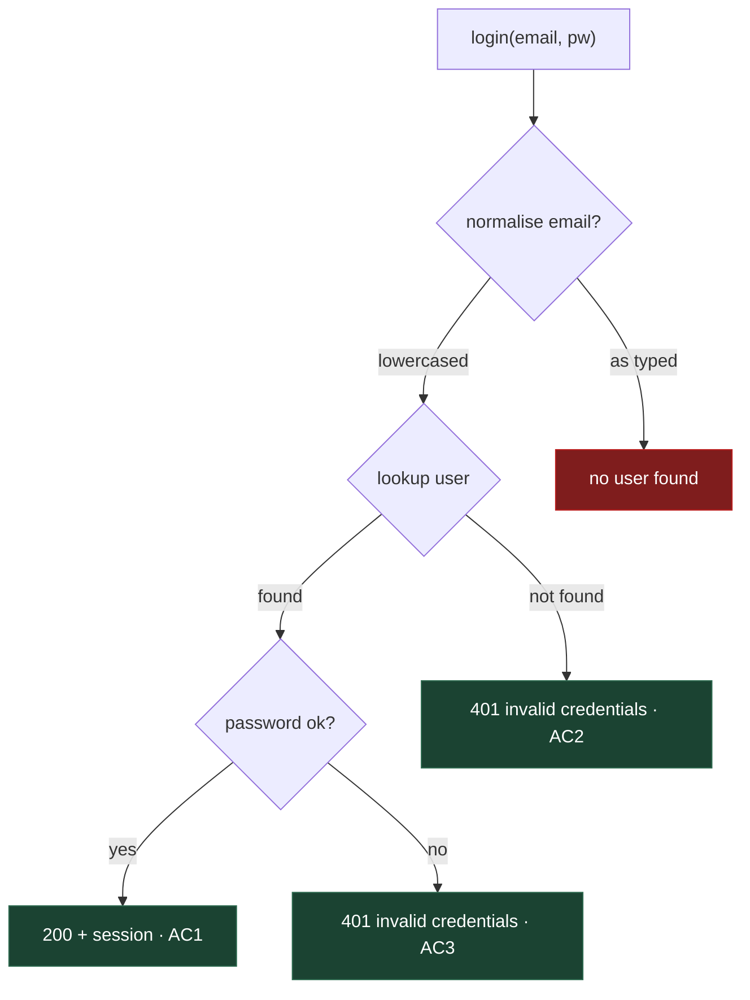

# Test rigour: interrogating behaviour before writing the test plan

## The problem

Tickets written by this plugin pass every existing gate while covering only the
happy path. Three specific defects, all reproducible against the current skills:

**Nothing asks how the feature behaves.** `ticket-authoring` stage 1 runs a
five-question interview, and all five are about *why the feature exists* — who
is stuck, what they do today, what happens if it is never built. Not one asks
what the feature does with invalid input, or what happens when a dependency
fails. The interview ends at the story and never resumes. Acceptance criteria
are therefore written from the author's imagination rather than from anything
interrogated.

**Unhappy paths are advice, never a gate.** The phrase appears three times —
`design-sketching` says "show the unhappy path", the ticket template repeats it
in a comment, `manual-test-design` says include the negative. All three are
guidance about *how to write a section well*. The acceptance-criteria and
test-plan sections carry no failure-path requirement at all, and
`ticket-refinement` checks that every criterion has a test without ever asking
whether the criteria cover failure. A ticket with five happy-path criteria and
five matching tests is currently assessed as ready.

**Parity is absent entirely.** Nothing looks at the features a new one sits
alongside. The PUT-versus-PATCH line in the design section is the only
parity-shaped text in the plugin and it is incidental to a different point.

A fourth defect sits underneath the first three and is the most expensive,
because no amount of failure-path thinking finds it: **the set of values the
real world supplies is wider than the set the tests use, and the code often has
no branch there at all.** An email stored as `Alex@foo.com` and looked up as
typed fails login on a case-insensitive expectation. Nothing throws. There is
no error path to have forgotten, no edge to have left off a diagram. Asking
"what happens when the lookup fails?" does not find it. Asking "what does the
real world actually type into this field?" does.

## The shape of the fix

A second interview, between the story gate and the design, whose answers become
the acceptance criteria directly.

```
STAGE 1  why-interview ──────────────▶ story ──▶ ⛔ GATE: human agrees the problem
                                                     (unchanged)

STAGE 2  behavioural interview ──┬──▶ failure modes
         (NEW)                   ├──▶ input domains
                                 └──▶ parity vs siblings
                                          │
                                          ▼
         design + coverage diagram + ACs + test plan
                                          │
                                          ▼
                              ⛔ GATE: human signs off the TESTS
                                 (existing Ready gate, re-pointed)
```

The ordering is the mechanism. Criteria derived from a walked checklist are
criteria nobody had to think of unprompted, which is why this fixes the
imagination problem rather than exhorting people to imagine harder.

## Files

| File | Change |
|---|---|
| `skills/ticket-authoring/references/interview.md` | **New.** The three question banks. |
| `skills/design-docs/SKILL.md` | **New.** The appendix-document convention, anchor IDs, and the freshness rule. |
| `skills/ticket-authoring/SKILL.md` | New stage 2 interview section; sign-off ask re-pointed at the tests; design docs written before the ticket. |
| `skills/ticket-authoring/references/ticket-template.md` | Synopsis-and-table sections replacing inline detail; `Design docs` links. |
| `skills/design-sketching/SKILL.md` | Coverage-diagram pattern with fixed hex colours. |
| `skills/ticket-refinement/SKILL.md` | Three new checks in the step-2 ladder, plus anchor resolution. |
| `skills/red-green/SKILL.md` | Design-doc edit belongs in the green commit; `design:` comment convention. |
| `skills/review-handoff/SKILL.md` | Anchor check in the handoff; doc-freshness question. |
| `skills/review-handoff/scripts/design-anchors.sh` | **New.** Verifies every `design:` comment resolves to a real anchor. |

The question banks go in a reference file rather than inline because
`ticket-authoring/SKILL.md` is already 507 lines; three banks inline would push
the skill's own structure past findability. `design-sketching` already
establishes this pattern with `references/diagram-patterns.md`.

## The ticket is a synopsis, not the document

Rigour that nobody reads is worse than no rigour, because a rubber-stamped gate
manufactures confidence. Three interview transcripts, a parity table, an
input-domain matrix and a coverage diagram inline produce a ticket people
scroll past.

So the detail lives in `design-docs/` and the ticket carries a synopsis plus
tables that link into it:

```
design-docs/
  rfc/
    0003-session-identity.md
  features/
    auth-email-normalisation.md     ← design + failure modes + input domains
```

On the ticket:

```markdown
## Design docs

- [Email normalisation](../design-docs/features/auth-email-normalisation.md) — the design, all three interview axes, the coverage diagram

## Failure modes

6 identified, 4 covered. Full analysis in the design doc.

| Mode | Covered | Criterion |
|---|---|---|
| blank name | yes | AC2 |
| provider timeout | yes | AC4 |
| concurrent write to one row | **no** | out of scope, pre-existing |
```

The human reads a table and follows a link when they want the argument. The
coverage diagram stays **on the ticket** — it is the thing being signed off and
it is already a summary.

## Anchored links, in both directions

Code and tests carry a comment naming the design section they implement:

```go
// design: design-docs/features/auth-email-normalisation.md [AUTH-3]
func normaliseEmail(s string) string {
```

```markdown
## Email normalisation {#AUTH-3}
```

**The anchor ID is stable and the heading text is not.** A plain
`#email-normalisation` slug link breaks silently the moment someone retitles the
heading: nothing fails, and the comment goes on reading as authoritative while
pointing at nothing. An explicit `{#AUTH-3}` survives retitling, and — the part
that matters — a script can verify it.

`scripts/design-anchors.sh` greps every `design:` comment, resolves each against
its document, and fails on a missing file or a missing anchor. It runs at the
same gate as the test inventory, reusing that script's file-walking and
config-reading. A broken link is therefore a handoff failure, not a discovery
made months later by someone who trusted the comment.

Anchor IDs are per-document and allocated in order (`AUTH-1`, `AUTH-2`). The
prefix comes from the document, not the ticket, so a second ticket touching the
same design adds `AUTH-7` rather than renumbering anything.

## Keeping the docs true

The freshness rule is enforced where the behaviour changes, not at a later
audit:

**In `red-green`.** The design doc is updated in the **same commit** as the
behaviour that diverges from it. Same discipline as the red→green pair: it is
visible in the diff and checkable afterwards. A green commit that changes
behaviour the doc describes, without touching the doc, is the defect.

**In `review-handoff`.** Two checks before the PR opens:

1. `design-anchors.sh` passes — every `design:` comment resolves.
2. If the diff changed behaviour under a `design:` comment and the referenced
   document is untouched since the ticket was written, **ask**: is the document
   still true?

The second is a question rather than a hard failure, because a refactor can
legitimately leave the design unchanged. But it is asked every time, and the
answer goes in the handoff where a reviewer sees it.

## Deferred: the design graph

[Graphify](https://github.com/Graphify-Labs/graphify) already models exactly the
structure this design creates — its markdown extractor emits a node per heading
and a `heading --references--> code symbol` edge, `EXTRACTED` for a
path-qualified mention and `INFERRED` for an unambiguous bare name. A codebase
following this spec would graph well.

It is deliberately **not** a dependency yet:

- This plugin currently has no hard external dependencies. Every provider
  resolves through `capabilities.md` with a built-in fallback, which is why it
  works for someone with no other plugins installed. Graphify would be the
  first thing that breaks when an external tool moves — and at 1,505 open
  issues on a `v8` branch four weeks after its first commit, it is moving fast.
- It rebuilds *the graph*, not the docs. It cannot tell you a document's claims
  have stopped being true, which is the actual requirement here.
- There is nothing to graph until design docs exist. This spec creates the
  corpus; graphing it is a later question answered by whether navigation
  actually hurts.

When that question is answered, the shape is a `design-graph` capability —
preferred provider `graphify`, no fallback, built-in "grep `design-docs/`" —
following the existing pattern rather than hard-wiring anything.

## The three axes

Each axis walks a closed list, so an answer of "nothing to report" has to be
given rather than reached by omission. Each produces acceptance criteria
directly.

### Axis 1 — failure modes

For each step in the flow, against this list: dependency unavailable,
dependency slow, dependency returns malformed data, partial write, concurrent
writer, permission absent, resource missing, resource already exists.

Each answer becomes an observable criterion, and the criterion must say what
does *not* happen as well as what does:

```
AC4  a provider timeout surfaces as 503, and the record is NOT written
```

The negative half is the part that gets dropped, and it is usually the part a
test can catch.

### Axis 2 — input domains

For **each input the feature accepts**, against this list:

| Dimension | The question | Worked example |
|---|---|---|
| case | does case matter, and is it normalised on write **and** read? | `Alex@foo.com` |
| whitespace | is leading and trailing whitespace trimmed? | `" alex@foo.com"` |
| unicode | accented, non-Latin, combining characters? | `josé` vs `jose´` |
| length | at zero, at the column limit, past it? | a 320-character email |
| absence | empty, null and absent — three cases or one? | `""` vs `null` vs missing |
| uniqueness | can two values differ only by normalisation? | `Alex@` and `alex@` are one user |

**"On write and read" is load-bearing.** Normalising at signup alone still
breaks login, because the lookup compares the raw input against the stored
value. That asymmetry is the bug in the motivating example, and the question
names it rather than leaving it to be noticed.

One input can legitimately produce several criteria:

```
AC5  Alex@foo.com and alex@foo.com resolve to the same account on login
AC6  " alex@foo.com" is trimmed before lookup
AC7  an accented local part is accepted and NFC-normalised
AC8  an empty email returns 422, distinct from an absent one
AC9  signup with Alex@ when alex@ exists is rejected as a duplicate
```

### Axis 3 — parity

Grep for what sits alongside the feature — the other endpoints on the resource,
the other tabs, the other providers, the other half of a symmetric pair — and
tabulate this ticket's behaviour against theirs:

```markdown
## Parity

Checked against the sibling endpoints on /records:

| | GET | POST | PUT | this (PATCH) |
|---|---|---|---|---|
| 422 on blank name | n/a | yes | yes | yes |
| auth required | yes | yes | yes | yes |
| empty list as [] | yes | n/a | n/a | n/a |
| soft-delete aware | yes | n/a | NO | NO ← |

PUT ignores soft-deleted rows too. The divergence from GET is pre-existing and
not introduced here.
```

Every divergence is either a stated decision or a bug. An unexplained one in
the table is the latter.

### The closing question

Each axis ends the same way: **"which of these are we deliberately not
covering, and why?"**

A waived mode that has been named is a decision, and it is recorded. A mode
nobody mentioned is the defect this whole design exists to surface.

## The coverage diagram

Colour marks test coverage. Green is covered by a test in the plan; red is a
known path with no test.



The red box is the point of the diagram. It is what the human looks at before
signing off, and in the motivating example it is the bug — drawn, visible, and
unticked, before the feature shipped.

Three rules, each forced by something checked rather than assumed:

**Use these four hex values.** Verified with `mmdc`: `classDef` emits
`fill: … !important` on the node rect and `color:#fff !important` on the label,
so the fills survive GitHub's theme CSS. Dark fills with white text read on
both GitHub themes. The pale pastels people reach for — `#d4edda` and its
relatives — are illegible on dark, which is why the skill specifies values
instead of saying "use red and green".

**Colour nodes, not edges.** Mermaid has no per-edge `classDef` that renders
reliably on GitHub. This is the better convention regardless: a test asserts an
*outcome*, so the outcome box is the honest place for the marker.

**Put the criterion in the node label.** `"401 invalid credentials · AC3"`,
not a separate annotation node joined by a dotted edge. Annotation nodes double
the node count and breach the dozen-node limit `design-sketching` already sets.

## The gates

**Authoring sign-off.** One gate, not two. The existing Backlog → Ready ask is
re-pointed: the test plan posts as its own comment, and the ask names every
waived mode, so the human's move to Ready *is* the test sign-off.

> #7 is written: <url>
>
> The test plan is comment 4. Before you move it to Ready, read it as the
> definition of done — if a test is missing there, it will not be written.
>
> Three failure modes found, two covered:
>  ✓ blank name → 422
>  ✓ provider timeout → 503, no partial write
>  ✗ concurrent PATCH on the same row — out of scope, pre-existing, no test.
>
> Agree?

**Refinement.** Three checks join the step-2 ladder at the same strength as the
existing "every criterion has a test". Each is a *not ready* verdict:

- Criteria are all happy-path and no reason is stated.
- An input-domain dimension is unanswered for an identifier-like input.
- A red node on the diagram is unaccounted for in the body.

**Comments.** Each axis posts as its own comment; the body stays canonical and
the agreed result is folded in. This preserves the model in
`references/comments.md` rather than inverting it — comments hold the argument,
the body holds the result.

## Skip rules

Written visibly into each section, so a skipped section is a readable decision
rather than a hidden conditional.

| Section | Skipped when |
|---|---|
| Parity | nothing sits alongside the feature |
| Coverage diagram | fewer than two failure paths |
| Behavioural interview | complexity is trivial **and** nothing on `models.escalateOn` is touched |
| Failure modes | never — but "none, because this is a static string change" is a passing answer |

No new config block. These additions are the behaviour the plugin should always
have had, and a default-off switch would leave the defect in place for anyone
who never configures it.

## The cost, stated plainly

Tickets get meaningfully slower to write. The input-domain pass turned one
field into five criteria in the example above, and that is one field of one
feature.

That is the trade being made deliberately, and the skip rules are where it
stays proportionate. If it proves too heavy in practice, the first lever is to
narrow axis 2 to identifier-like inputs — emails, usernames, slugs, codes —
rather than every input the feature accepts. That change is one sentence in
`interview.md` and does not disturb anything else in this design.

## Out of scope

- **No graphify dependency**, per the section above. Revisited after the test
  application, as a `design-graph` capability.
- **No change to `test-inventory.sh`.** The test plan's format is unchanged —
  more lines, same shape. The anchor check is a sibling script, not an edit to
  a working one.
- **No new config block.** The skip rules carry proportionality instead, and a
  default-off switch would leave the defect in place for anyone who never
  configures it.
- **No change to the `comments.md` body-is-canonical model.** Interview
  transcripts post as comments; the agreed result is folded into the body and
  the detail lives in `design-docs/`.
- **No scheduled drift audit.** Freshness is enforced in the green commit and at
  handoff. A periodic sweep would catch rot those miss, but drift found weeks
  later is expensive to fix and the gate is the cheaper place.
- **No comment-to-doc links in every file.** Only where a `design:` anchor
  genuinely aids navigation — the convention is opt-in per symbol, because a
  codebase where every function carries one is a codebase where none of them
  are read.
