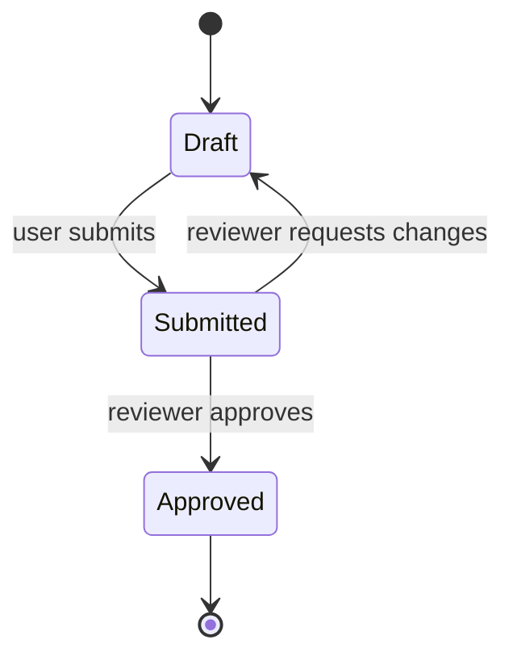

# Design sketching

A picture is worth a thousand words only when it replaces them. A diagram
alongside prose that says the same thing is two things to keep in sync and one
of them will rot.

GitHub renders Mermaid natively in issue bodies, comments and PR descriptions,
which is why diagrams belong in tickets rather than in a docs folder nobody
opens.

## When a diagram earns its place

Four shapes. If the design is not one of these, prose is probably better.

**A lifecycle.** Something has states and only some transitions are legal. Prose
describing a state machine is uniformly worse than the diagram, because the
reader has to build the graph in their head and will get an edge wrong.

**A sequence across components.** Three or more participants exchanging messages
in an order that matters. The failure mode of prose here is that it cannot show
two things happening between the same pair of participants at different times
without the reader losing track.

**A schema change.** New tables, new foreign keys, a join table. An ERD shows
cardinality in a way "each record can have many tags, and each tag many
records" does not.

**Branching logic with more than two branches.** A decision tree, a routing
rule, a validation cascade.

## When it does not

Be sceptical. Most tickets need no diagram, and the reflex to add one produces
decoration.

| Tempting | Better |
|---|---|
| A linear process with no branches | A numbered list |
| One request, one response | A code block with the request and response |
| The directory layout | A tree in a fenced block |
| "How the feature works" in general | Prose. The diagram will be vague because the thought is. |
| Anything with one box | Delete it |

A diagram that needs a paragraph explaining how to read it has failed.

## Picking the kind

| Design | Mermaid | Use when |
|---|---|---|
| Lifecycle, legal transitions | `stateDiagram-v2` | Something moves between states |
| Interaction over time | `sequenceDiagram` | Several participants, order matters |
| Schema, cardinality | `erDiagram` | Tables and their relationships |
| Branching decision | `flowchart TD` | Conditions producing different outcomes |

Four is the whole list you need. Mermaid supports more; the rest rarely earn
their place in a ticket.

See `references/diagram-patterns.md` for a worked example of each, including
the ones that most often come up in API work.

## Drawing it well

**One idea per diagram.** Two diagrams beat one that shows a lifecycle and a
sequence at once.

**Label the edges, not just the nodes.** An unlabelled arrow says something
happens; a labelled one says what causes it. In a state diagram the edge label
is the event, and it is usually the most informative text in the picture.

**Name things as the code names them.** If the handler is `UpdateRecord`, the
diagram says `UpdateRecord`, not "the update step". The diagram is a map of the
code, and a map with different place names is not useful.

**Show the unhappy path.** This is where diagrams earn most of their keep in a
ticket, because it is what prose consistently omits. The error transition, the
validation failure, the retry — those are the edges that get forgotten in
implementation and the diagram is where they become undeniable.

**Keep it under about a dozen nodes.** Past that, split it or raise the
abstraction. A diagram that needs scrolling in a GitHub issue will not be read.

**Delete the prose it replaced.** This is the step people skip. If the diagram
is good, the paragraph describing the same flow is now redundant — cut it. What
stays is the *why*, which a diagram cannot show.

## Where it goes

- **In the ticket**, under the design heading, once the user story is agreed and
  the technical shape is being worked out. A diagram drawn before the story is
  settled is a diagram of a guess.
- **In the PR body**, only when the implementation diverged from the ticket's
  diagram. Otherwise link the ticket.
- **Not in a comment** as the only record. Comments scroll away; fold it into
  the body.

## Check it renders

Mermaid fails silently on GitHub — a syntax error shows as a blank block or raw
text, and nobody tells you. After creating or editing an issue, open it and
look.

Common breakages: unquoted text containing `(`, `)`, `:` or `,` in a node label
(quote the whole label); `end` as a node id in a flowchart (reserved);
participant names with spaces in a sequence diagram (use an alias).

If that block renders as a picture in the issue you just wrote, the syntax is
fine.
