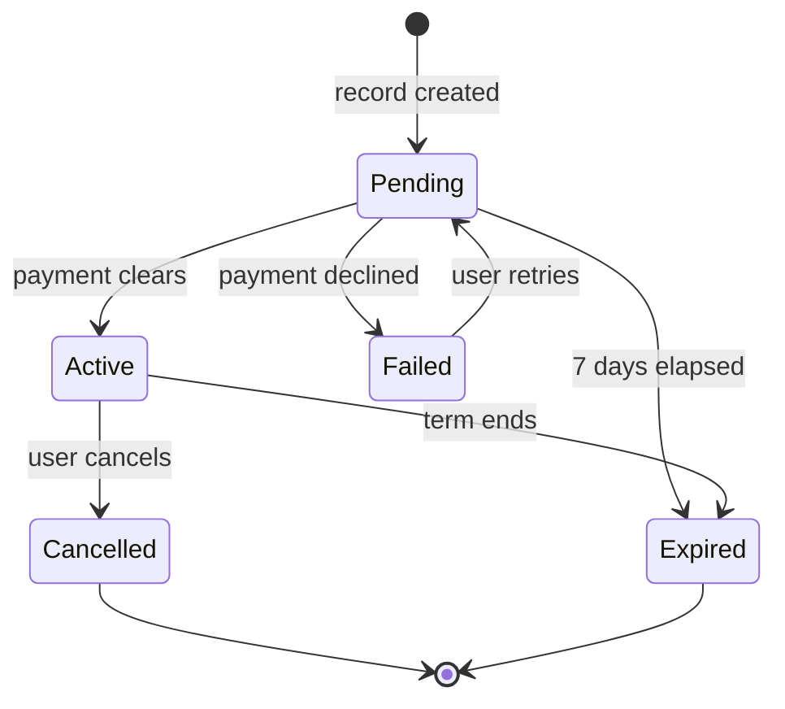
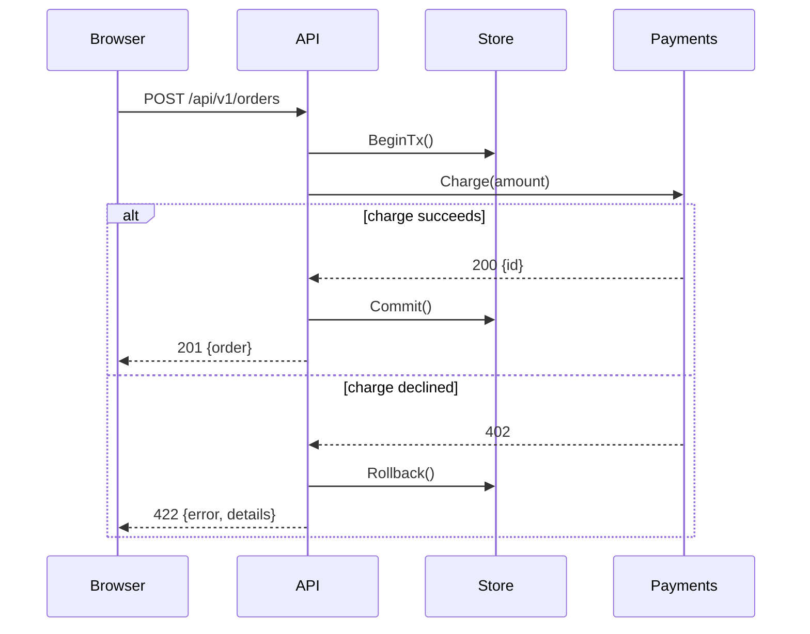
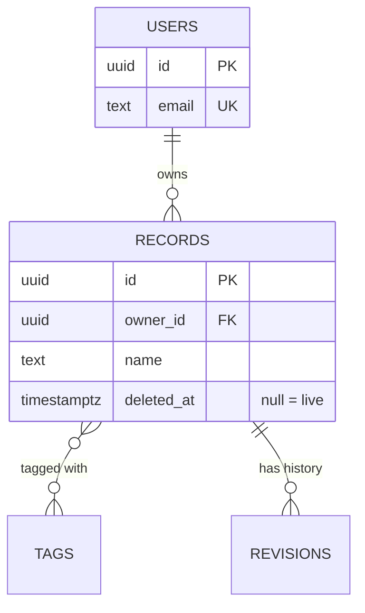
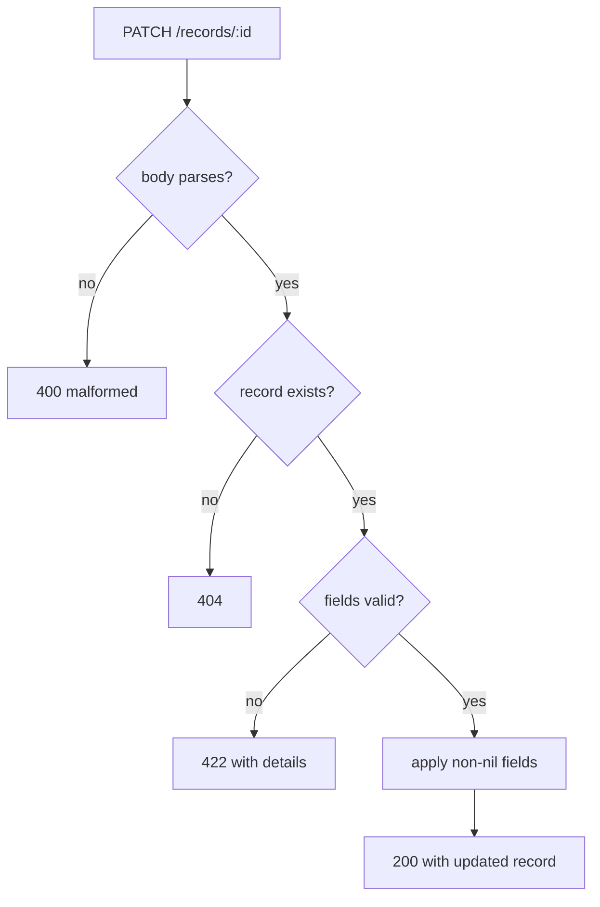

# Diagram patterns

Four kinds, worked. Copy the nearest and adapt. Each shows the unhappy path,
because that is the part prose omits and the part implementation forgets.

## Lifecycle — `stateDiagram-v2`

Something has states and only some transitions are legal. The edge labels are
the events, and they carry most of the information.

The value here: `Failed → Pending` is a real edge someone will forget, and
`Active → Expired` and `Cancelled → [*]` differ in a way prose blurs.

## Sequence — `sequenceDiagram`

Three or more participants, order matters. Use `alt` for the failure branch —
the whole reason to draw this rather than list steps.

Aliases (`participant B as Browser`) keep arrows short. Participant names with
spaces break without them.

## Schema — `erDiagram`

Tables and cardinality. Cardinality is the thing prose gets wrong.

Read the crow's feet: `||--o{` is one-to-many, `}o--o{` many-to-many. Include
only the columns the ticket touches — a full schema dump is noise.

## Branching — `flowchart TD`

A decision tree or validation cascade with more than two outcomes.

Quote any label containing `(`, `)`, `:` or `,`. Never use `end` as a node id —
it is reserved and breaks the render.

## Syntax that silently breaks GitHub

| Breaks | Fix |
|---|---|
| `A[Charge (card)]` | `A["Charge (card)"]` |
| `end` as a node id | rename it `done`, `finish` |
| `participant Order Service` | `participant OS as Order Service` |
| Smart quotes from a doc | plain ASCII quotes |
| A blank line inside the fence | remove it |

GitHub shows a failed diagram as an empty block or raw text with no error.
Always open the issue and look after posting.
