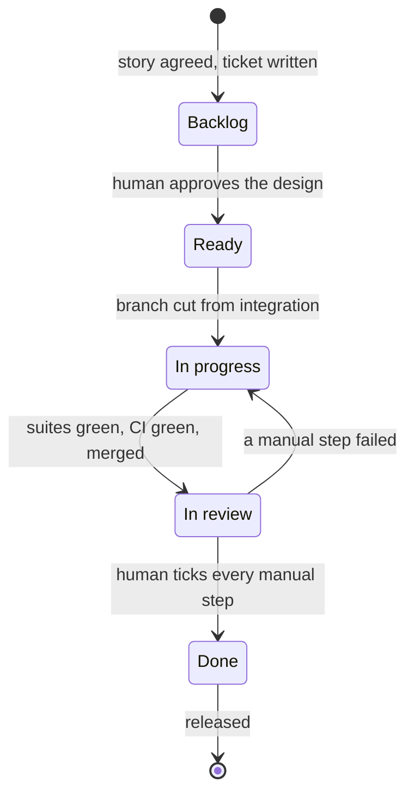

# Feature workflow

The spine. This skill does not do the work — it works out which phase you are
in and hands off to the skill that does.

## The state machine

Work moves in one direction, and each arrow has a gate that must be satisfied
before the card moves. There is exactly one backwards arrow.



| Transition | Gate | Who |
|---|---|---|
| → Backlog | User story agreed **first**, then technical design, criteria and test plan | `ticket-authoring` |
| Backlog → Ready | Every open question answered; criteria each verifiable | **human decides**, `ticket-refinement` advises |
| Ready → In progress | A feature branch exists, cut from the integration branch | `red-green` |
| In progress → In review | Every suite green, CI green, red→green pairs present, merged to integration | `review-handoff` |
| In review → Done | A human ticked every manual step | **human only** |
| In review → In progress | A manual step failed | `verification-failed` |

Two of these a machine must never perform: **moving a card to Ready**, and
**moving a card to Done**. Both are human judgement, and both are gates the
process depends on. Moving either one yourself to keep things flowing removes
the only checks that are not self-certified.

## Before anything else

1. **Read `.claude/workflow.config.json`.** If it is missing, this repo has not
   been set up. Say so and run `board-setup`; do not guess board numbers or
   column names.

2. **Resolve the repository from git, not from config:**

   ```bash
   gh repo view --json nameWithOwner -q .nameWithOwner
   ```

   The config deliberately does not store this, so a fork or rename cannot
   leave a stale value.

3. **Validate the board** with `ghboard validate`. It lists the live Status
   options and compares them to `project.columns`. If they disagree it stops.
   Do not "helpfully" create the missing column — a typo in the config and a
   genuinely absent column look identical from here, and one of those is fixed
   by editing a file while the other needs a human decision.

If `gh` is absent or unauthenticated, say so plainly and continue in local
mode: branches, TDD and commits all work offline. Board and PR steps are
deferred, not skipped — note which ones are outstanding.

## Capabilities, not providers

This plugin owns the board and the evidence. It delegates the thinking. Resolve
providers per `references/capabilities.md` at the plugin root — config first,
then detection, then ask once and record the answer.

Do not resolve every capability up front. Resolve `design-interview` when a
story needs interrogating, `tdd-discipline` when the first test is about to be
written. Asking about four toolchains before the user has described their
feature is how a workflow becomes a survey.

## The ticket is the record, not the chat

Whenever you act on an existing ticket, read it first — **body and comments**:

```bash
ghboard read 7        # body + every comment, in order
```

Decisions get made in comments once a ticket exists — a scope cut, an answer to
a question you asked, a "no, do it the other way". Working from the body you
wrote three hours ago means acting on a superseded plan.

At **resume** specifically, check what landed since you last worked:

```bash
ghboard comments 7 --after-commit
```

Anything it returns, surface before routing anywhere. Between sessions is
exactly when comments arrive, and a scope change folded in silently is a scope
change its author does not know you saw.

The full contract — what to look for at each stage, and how to fold decisions
back into the body — is `references/comments.md` at the plugin root.

Nothing polls GitHub. A comment sits unread until someone says "I commented on
#7" or the next `ghboard read`. Say so plainly when you hand a ticket over.

## Finding your way around the board

```bash
ghboard list              # every card and its column
ghboard list ready        # one column
ghboard find "private"    # search titles and bodies — for when you
                          # remember the ticket but not its number
ghboard next              # what to pick up: Ready, oldest first
ghboard stale             # Backlog cards that are old or incomplete
ghboard status 7          # which column is #7 in?
```

`stale` is the one worth running before asking "what should I do next?". It
flags Backlog tickets missing the sections a ticket needs before anyone could
start it — no acceptance criteria, no test plan, unfilled template
placeholders — and tickets that have simply sat there long enough to be worth
re-deciding. Those are refinement conversations, not work.

If `next` is empty and `stale` is full, the honest answer to "what's next" is
"nothing is ready; here are three tickets that need a decision from you".

## Routing

Work out the phase from evidence, in this order, and stop at the first match.

1. **On a feature branch?** (`git branch --show-current` matches
   `branches.featurePrefix`.) Extract the issue number from the branch name,
   then **read the ticket** — it may have come back from review.

   - **Carries the `verification-failed` label** → this is a re-entry. Read the
     failure comment before anything else and route to `red-green` with the
     failed step as the next behaviour to drive out. A failure a human found is
     still a bug: it gets a red test that reproduces it before any fix.
   - Uncommitted changes, or commits without a PR → phase 3. Continue the
     red→green loop via `red-green`.
   - Everything green and something to ship → `review-handoff`.
   - Anything red → stay in `red-green` and fix it.

2. **Card in Done with unreleased commits on the integration branch?**
   → `release-to-production`.

3. **The user named a ticket or issue number?** Read it with
   `ghboard read <n>` — **body and comments** — check its column, and route by
   the state machine above.

4. **The user is reporting that a manual check failed?** → `verification-failed`.

5. **Nothing else matches** → phase 1. The story comes first: `ticket-authoring`
   opens with the user story and does not proceed to technical design until it
   is agreed.

## Starting work on a Ready ticket

Only from `ready`. A ticket in Backlog is written but not approved, and starting
it means building a design nobody agreed to.

**Always cut the branch from the integration branch, never from production:**

```bash
git fetch origin
git checkout -b <featurePrefix><issue-number>-<slug> origin/<integration>
```

e.g. `git checkout -b feature/42-put-endpoint origin/dev`.

Branching from production while integration is ahead means the PR back either
carries commits already there or conflicts with them — in both cases the diff a
reviewer sees is not the work. `review-handoff` computes its test inventory
from `git merge-base HEAD origin/<integration>`, so a wrong base produces a
wrong inventory too.

The issue number in the name is how every later step finds its way back to the
ticket. A branch without one breaks the chain.

Then move the card, because now it is true:

```bash
ghboard move <issue> inProgress
```

If `origin/<integration>` does not exist, stop and say so — the whole flow
depends on it:

```bash
git checkout -b dev main && git push -u origin dev
```

## What this skill will not do

- Move a card to Ready. That is the human's approval of the design.
- Move a card to Done. That is the human's verification, and it is what
  authorises a release.
- Start implementation on a ticket still in Backlog.
- Write code before a ticket exists, however small the change sounds.
- Invent board columns, issue numbers or test results.
