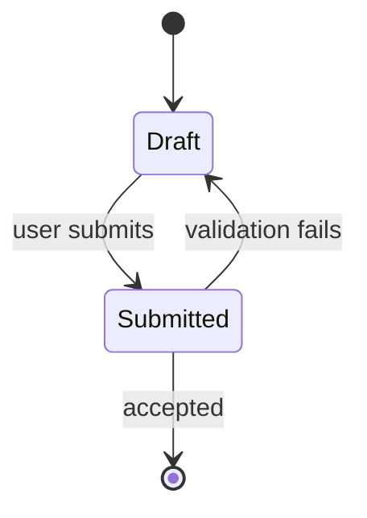

# <verb-first summary>

## Why

<One paragraph of prose. Who is stuck, what they are trying to do, why today
fails them. Not "As a… I want… so that…". If you cannot name someone who
benefits, question whether the work should happen.>

## Capabilities

<Observable behaviours, one per line. "The console can send a PUT" is a
capability. "Add a Replace method to the store" is an implementation detail and
belongs in Design or nowhere.>

- <behaviour>
- <behaviour>

## Out of scope

<What this ticket explicitly does not do. The section that stops a reviewer
asking "but what about…" and stops the implementer quietly widening the work.>

- <thing>

## Design

<For API work: method, path, request body, every status code and what each
means. PUT vs PATCH decided here, not while coding.>

| Method | Path | Body | Returns |
|---|---|---|---|
| | | | |

<A Mermaid diagram if the design has a lifecycle, a multi-participant sequence,
a schema change, or branching logic. See the design-sketching skill. Delete
this block if it does not. Show the unhappy path — that is the part prose
forgets.>

## Prerequisites

<Capabilities this story assumes. Each one checked against the code, not
assumed. If one is missing, say how it is handled — split, stub, or cut.>

- [ ] <thing the story assumes> — <present / stubbed / split into #N>

## TDD test plan

<Each line: suite tag, the acceptance criterion it proves, the behaviour.
Every acceptance criterion below must appear at least once here.>

- [go]     AC1 · <behaviour>
- [vitest] AC2 · <behaviour>
- [manual] AC3 · <behaviour> — <why this cannot be automated>

## Acceptance criteria

<Each independently verifiable by someone who did not write the code. Each an
observable outcome. "Works correctly" is not a criterion.>

- [ ] **AC1** <observable outcome>
- [ ] **AC2** <observable outcome>
- [ ] **AC3** <observable outcome>

## Manual verification checklist

_Filled in by `review-handoff` once the work is on the integration branch and
there is a real UI to write steps against._
