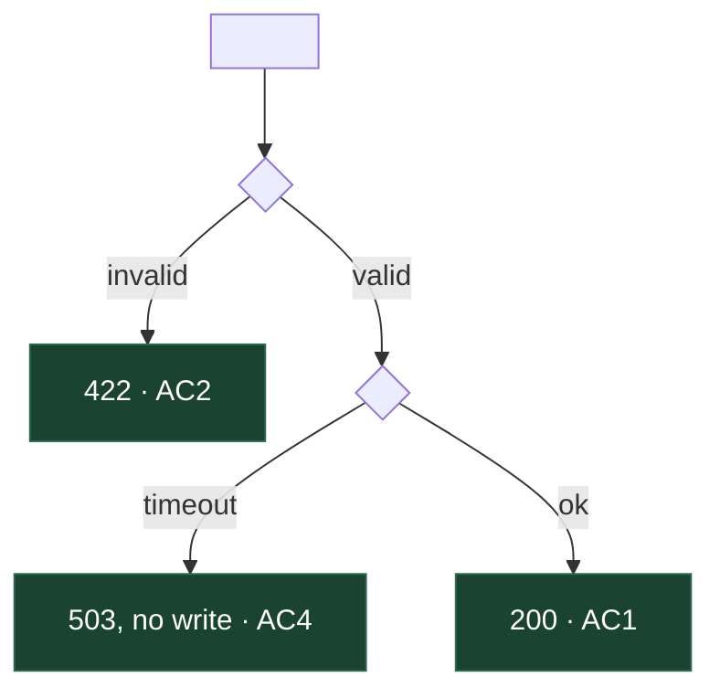

# <verb-first summary>

## Why

<One paragraph of prose. Who is stuck, what they are trying to do, why today
fails them. Not "As a… I want… so that…". If you cannot name someone who
benefits, question whether the work should happen.>

## Capabilities

<Observable behaviours, one per line. "The console can send a PUT" is a
capability. "Add a Replace method to the store" is an implementation detail and
belongs in Design or nowhere.>

- <behaviour>
- <behaviour>

## Out of scope

<What this ticket explicitly does not do. The section that stops a reviewer
asking "but what about…" and stops the implementer quietly widening the work.>

- <thing>

## Priority

<Only when the config has a `priority` block. The level, then one sentence
saying why this level and not the one above or below. Delete this section
entirely if priority is not configured.>

**Priority P2.** <why, arguing both boundaries>

## Size

<Only when configured. The value, anchored to a real ticket rather than an
adjective. Delete if not configured.>

## Complexity

<Only when configured. How hard to get RIGHT, not how much of it there is.
One sentence saying why this level and not the one below. Delete if not
configured.>

**Complexity: <level>.** <why>

## Model

<Only when `models` is configured. Which model should implement this, from the
complexity above, plus any escalation and its reason. The human switches with
/model before starting; nothing switches automatically. Delete if not
configured.>

**Model: `<name>`.** <why, including any escalation. This is a suggestion the
author confirmed, not a constraint: whoever picks the ticket up may choose
otherwise, and a larger model is always a safe departure.>

## Blocked by

<Only on a sub-issue that cannot start yet. List the sibling issues that must
close first, e.g. `Blocked by #12, #13`. Delete when nothing blocks it.>

## Design docs

<Where the detail lives. Written BEFORE this ticket, so these links resolve.
See the design-docs skill. Delete if the ticket is small enough that the
sections below say everything.>

- [<area>](design-docs/features/<area>.md) — design, the three interview axes,
  alternatives considered

## Design

<The shape only. Method, path, body, status codes — the contract a reader needs
without opening the doc. PUT vs PATCH decided here, not while coding. Anything
that needs a paragraph of reasoning belongs in the design doc.>

| Method | Path | Body | Returns |
|---|---|---|---|
| | | | |

### Coverage

<Stays on the ticket, not in the doc: this is the artifact being signed off.
Green is covered by a test in the plan, red is a known path with NO test. An
unexplained red box is the thing the human is agreeing to. Use these four hex
values — pale fills are illegible on GitHub dark. See design-sketching. Delete
if there are fewer than two failure paths.>

```mermaid
flowchart TD
    In["<entry point>"] --> V{"<validation>"}
    V -->|"invalid"| E422["422 · AC2"]
    V -->|"valid"| W{"<the write>"}
    W -->|"timeout"| E503["503, no write · AC4"]
    W -->|"ok"| OK["200 · AC1"]

    OK:::covered
    E422:::covered
    E503:::covered

    classDef covered fill:#1b4332,stroke:#2d6a4f,color:#fff
    classDef gap fill:#7f1d1d,stroke:#b91c1c,color:#fff
```

## Failure modes

<A count and a table, not the analysis. Full walk in the design doc. Every row
either names the criterion that covers it or says why nothing does — an
uncovered row with no reason is the defect this section exists to surface.
Never delete this section: "none, because this changes a static string and has
no inputs, dependencies or failure path" is a complete answer.>

<N> identified, <M> covered. Full analysis in the design doc.

| Mode | Covered | Criterion / why not |
|---|---|---|
| <mode> | yes | AC<n> |
| <mode> | **no** | <reason it is out of scope> |

## Input domains

<Only for inputs that are compared, looked up or deduped — emails, usernames,
slugs, codes. One row per dimension that mattered. Delete for a feature whose
inputs are only stored.>

| Input | Dimension | Decided behaviour | Criterion |
|---|---|---|---|
| <field> | case | normalised on write AND read | AC<n> |
| <field> | absence | empty 422, absent 422, distinct | AC<n> |

## Parity

<Delete when nothing sits alongside this feature. Otherwise a table: every
divergence is a stated decision or a bug, and an unexplained cell is the
latter.>

| | <sibling> | <sibling> | this |
|---|---|---|---|
| <behaviour> | yes | yes | yes |

## Prerequisites

<Capabilities this story assumes. Each one checked against the code, not
assumed. If one is missing, say how it is handled — split, stub, or cut.>

- [ ] <thing the story assumes> — <present / stubbed / split into #N>

## Acceptance criteria

<Each independently verifiable by someone who did not write the code. Each an
observable outcome. "Works correctly" is not a criterion.

These come from the interview, not from the design. Failure paths are not
optional: a list that is all happy-path means the interview happened and its
results were thrown away. Say what does NOT happen where that is the point —
"returns 503" passes with a half-written record, "503 and the record is not
written" does not.>

- [ ] **AC1** <observable outcome — the happy path>
- [ ] **AC2** <observable outcome — a validation failure>
- [ ] **AC3** <observable outcome — an input-domain decision>
- [ ] **AC4** <observable outcome — a failure mode, including what does not happen>

## TDD test plan

<Each line: suite tag, the acceptance criterion it proves, the behaviour.
The tag is a KEY from `tests` in workflow.config.json, or `manual` — not a
framework name. Every acceptance criterion above must appear at least once.

This is the section the human signs off. A behaviour missing from this list
will not be built.>

- [<suite-key>] AC1 · <behaviour>
- [<suite-key>] AC2 · <behaviour>
- [<suite-key>] AC3 · <behaviour>
- [<suite-key>] AC4 · <behaviour>
- [manual]      AC5 · <behaviour>. <why this cannot be automated>

## Logging

<Only when the config has a `logging` block AND the feature touches something
in `logByDefault`. What it logs, at what level, and what it must never log.
Three lines, not three paragraphs. Delete if neither applies.>

## Manual verification checklist

_Filled in by `review-handoff` once the work is on the integration branch and
there is a real UI to write steps against._

## This ticket has been tested by

<Only when the config has a `testers` list. One checkbox per person, so
sign-off has an owner. Omit on a security ticket. Delete if not configured.>
